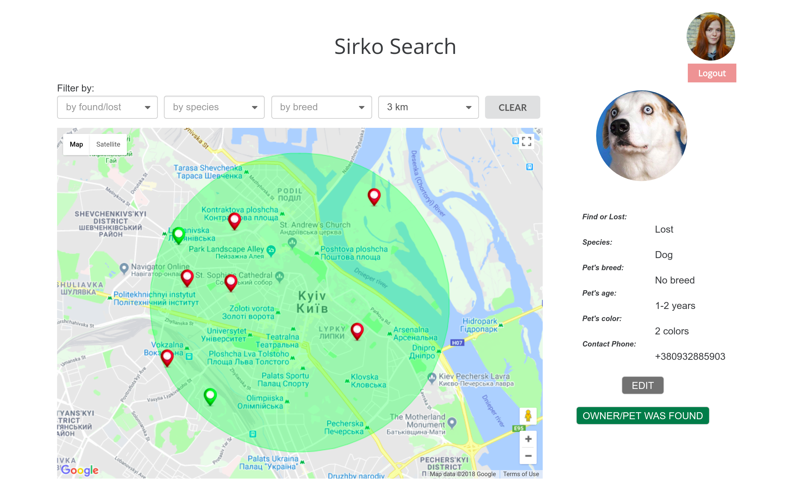

This project was bootstrapped with [Create React App](https://github.com/facebookincubator/create-react-app).

To start:

cd find-dog
yarn install
yarn start

!NB Please run the app on http://localhost:3000/, do not change the port

I wish I can create the build folder for you (by simply running npm build), 
but in this case it turns out that you will can not use Google Sign In by trying to test my app 
directly accessing files locally (index.html). The Google Sign In API only works in a running web server.
And I register it to works on http://localhost:3000/, so please do not change the default port.

